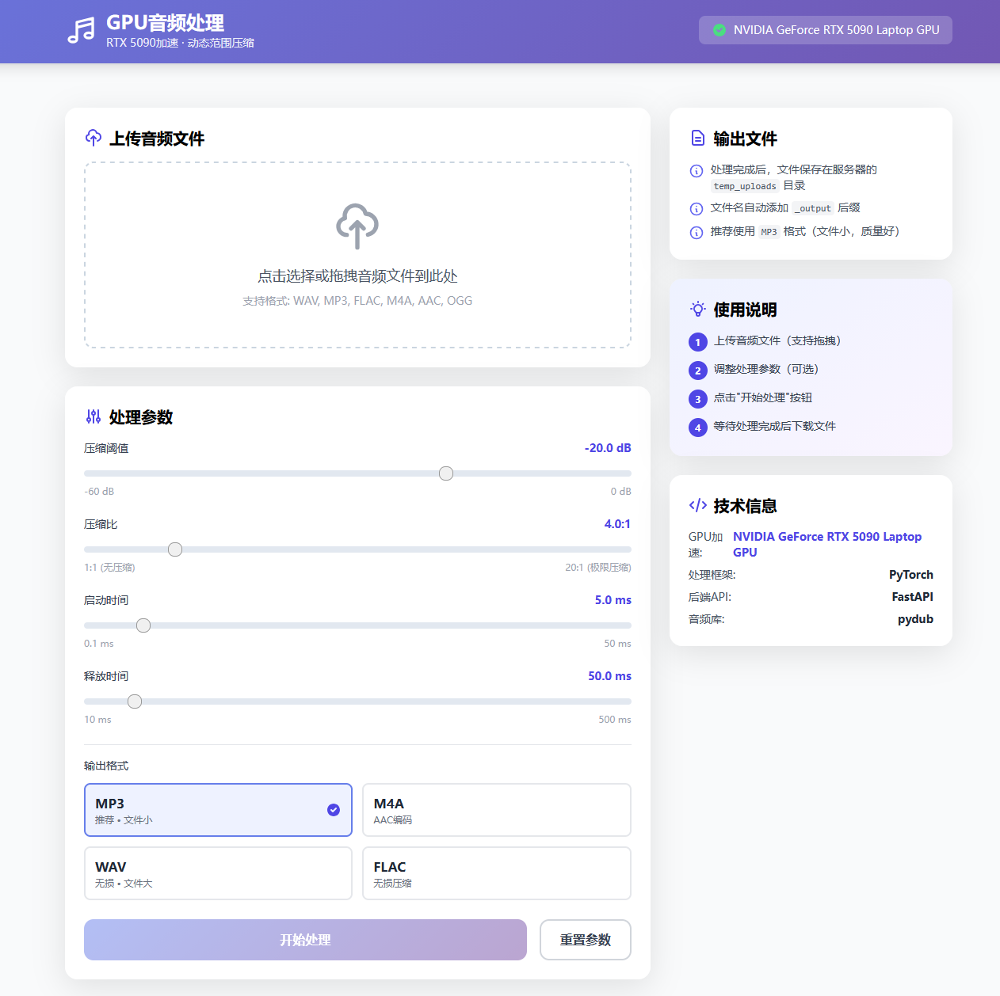

# GPU音频处理工具 - Web界面

基于RTX 5090的GPU加速音频动态范围压缩工具，提供友好的Web界面。


## ✨ 特性

- 🚀 **GPU加速**: 使用PyTorch在RTX 5090上实现高速并行处理
- 🎨 **现代界面**: 响应式设计，美观易用
- 📊 **实时反馈**: 处理进度实时显示
- 🔧 **参数可调**: 支持自定义压缩参数
- 📁 **便捷操作**: 支持拖拽上传，一键下载
- 🎬 **视频支持**: 支持上传视频文件，自动提取音频进行处理

## 📋 系统要求

- Python 3.8+
- CUDA 11.8+ (GPU加速)
- RTX 5090 或兼容GPU

## 🛠️ 安装

### 1. 安装依赖

```bash
pip install -r requirements.txt
```

### 2. 安装ffmpeg (音频处理必需)

**Windows:**
```bash
# 使用 Chocolatey
choco install ffmpeg

# 或从官网下载: https://ffmpeg.org/download.html
```

**Linux:**
```bash
sudo apt update
sudo apt install ffmpeg
```

**macOS:**
```bash
brew install ffmpeg
```

## 🚀 使用方法

### 启动服务器

```bash
cd audio_preprocessing
python api_server.py
```

服务器将在 `http://localhost:8000` 启动。

### 访问Web界面

在浏览器中打开:
- 主界面: `http://localhost:8000` (需要配置静态文件服务)
- API文档: `http://localhost:8000/docs`

### 操作步骤

1. **上传音频/视频**: 点击上传区域或拖拽文件
   - 支持音频格式: WAV, MP3, FLAC, M4A, AAC, OGG
   - 支持视频格式: MP4, AVI, MOV, MKV, WMV, FLV, WebM
   - 上传视频后会自动提取音频
2. **调整参数**: 根据需要调整压缩参数
3. **开始处理**: 点击"开始处理"按钮
4. **下载结果**: 处理完成后下载输出文件

## 🎛️ 参数详解与声音调整指南

### 什么是动态范围压缩（DRC）？

动态范围压缩是一种音频处理技术，用于**缩小音频最响和最安静部分之间的音量差距**，让声音更加均衡、一致。

**核心原理**：
- 压缩超过阈值的响亮部分
- 然后可以整体提升音量
- 结果：小声音变大了，大声音不会过大
- 效果：声音更均衡、更清晰、更易听

---

### 📊 参数详细说明

#### 1. 压缩阈值 (Threshold) ⭐ 最重要

**范围**: -60dB ~ 0dB
**默认**: -20dB
**含义**: 音量达到多少分贝时开始压缩

**作用机制**：
- 音量 > 阈值 → 超出部分被压缩
- 音量 < 阈值 → 不受影响

**对声音的影响**：

| 阈值设置 | 效果 | 适用场景 |
|---------|------|---------|
| **-10dB ~ -5dB** (高阈值) | 轻微压缩，只压缩极响部分 | 动态范围大的音乐、现场录音 |
| **-20dB ~ -15dB** (中阈值) ⭐推荐 | 适中压缩，平衡效果好 | **大多数录音、会议记录** |
| **-30dB ~ -25dB** (低阈值) | 强烈压缩，声音更均衡 | 音量不稳定的采访、语音 |
| **-40dB以下** (极低阈值) | 极强压缩，声音很平 | 广告、旁白（慎用） |

**🎯 如何让小声音变大？**
- **降低阈值**（如从-20dB调到-30dB）
- 更多内容被压缩 → 可以整体提升音量
- 小声音会明显变大，大声音被控制

---

#### 2. 压缩比 (Ratio)

**范围**: 1:1 ~ 20:1
**默认**: 4:1
**含义**: 超过阈值的音量按比例压缩

**计算公式**：
```
输出音量增量 = 输入音量增量 / 压缩比
```

**实际效果**：

| 压缩比 | 含义 | 效果 | 适用场景 |
|-------|------|------|---------|
| **1:1** | 无压缩 | 保持原动态 | 不处理 |
| **2:1** | 轻微压缩 | 每2dB压成1dB | 音乐、乐器 |
| **4:1** ⭐ | 适中压缩 | 每4dB压成1dB | **人声、会议** |
| **8:1 ~ 10:1** | 强压缩 | 每8-10dB压成1dB | 采访、播客 |
| **20:1** | 极限压缩（接近限制器） | 几乎完全限制峰值 | 广告、演讲 |

**对均衡度的影响**：
- **低比值 (2:1)**: 自然，动态范围保留较好
- **中比值 (4:1)**: 平衡，音量更一致
- **高比值 (8:1+)**: 非常平，但可能不自然

**🎯 提升小声音的建议**：
- 使用 **4:1 ~ 6:1** 的中等压缩比
- 配合较低的阈值（-25dB ~ -30dB）
- 可以显著提升整体音量的一致性

---

#### 3. 启动时间 (Attack)

**范围**: 0.1ms ~ 50ms
**默认**: 5ms
**含义**: 音频超过阈值后，压缩器多快开始工作

**对声音的影响**：

| 设置 | 效果 | 适用场景 |
|------|------|---------|
| **0.1ms ~ 2ms** (极快) | 立即压缩，保持音头有力 | 打击乐、鼓 |
| **5ms ~ 10ms** ⭐ | 自然过渡，兼顾音头和均衡 | **人声、大多数场景** |
| **20ms ~ 50ms** (较慢) | 让音头先通过，更柔和 | 温和的音乐、环境音 |

**音质影响**：
- 太快：声音可能"咔嗒"，失去冲击力
- 太慢：瞬态响度无法控制
- 推荐值：**5ms**（适合大多数情况）

---

#### 4. 释放时间 (Release)

**范围**: 10ms ~ 500ms
**默认**: 50ms
**含义**: 音频回落到阈值以下后，压缩器多快恢复

**对声音的影响**：

| 设置 | 效果 | 适用场景 |
|------|------|---------|
| **10ms ~ 30ms** (快) | 快速恢复，呼吸声明显 | 快节奏音乐 |
| **50ms ~ 100ms** ⭐ | 自然衰减，听感舒适 | **人声、语音** |
| **200ms ~ 500ms** (慢) | 平滑过渡，整体提升 | 环境音乐、慢歌 |

**音质影响**：
- 太快：声音"抽吸"（pumping），不自然
- 太慢：失去动态，声音"压扁"
- 推荐值：**50ms ~ 100ms**

---

## 🎯 实用参数预设

### 预设1: 会议录音（提升小声音）⭐ 推荐
**目标**: 让安静的部分也能听清，声音更均衡

```
阈值: -25dB
压缩比: 4:1
启动: 5ms
释放: 100ms
```

**效果**:
- ✅ 小声音明显变大
- ✅ 大声部分不会过载
- ✅ 整体音量提升，更易听

---

### 预设2: 访谈/播客
**目标**: 声音平稳，专业感

```
阈值: -20dB
压缩比: 6:1
启动: 10ms
释放: 50ms
```

**效果**:
- ✅ 声音非常一致
- ✅ 适合混音
- ✅ 专业广播效果

---

### 预设3: 课程/讲座
**目标**: 清晰度优先，减少音量波动

```
阈值: -30dB
压缩比: 8:1
启动: 15ms
释放: 150ms
```

**效果**:
- ✅ 即使很远也能听清
- ✅ 非常平的音量曲线
- ⚠️ 可能略显不自然

---

### 预设4: 音乐保留动态
**目标**: 轻微处理，保持原有动态

```
阈值: -15dB
压缩比: 2:1
启动: 5ms
释放: 50ms
```

**效果**:
- ✅ 几乎听不出处理痕迹
- ✅ 保留音乐的动态表现
- ✅ 轻微提升整体音量

---

## 🔧 调试技巧

### 如何判断参数是否合适？

**听感检查**：
1. ✅ 小声音能听清了吗？
2. ✅ 大声音会吵吗？
3. ✅ 声音自然吗？（没有"抽吸"感）
4. ✅ 整体音量一致吗？

**常见问题**：

| 问题 | 可能原因 | 解决方法 |
|------|---------|---------|
| 声音一跳一跳的 | Release太短 | 增加到100ms+ |
| 失去冲击力 | Attack太快 | 增加到10ms+ |
| 小声音还是听不清 | 阈值太高 | 降低阈值 |
| 声音压扁了 | 压缩比太高 | 降低到4:1 |

---

## 💡 让声音变大的完整流程

### 方法1: 使用推荐预设（最简单）
1. 选择"会议录音"预设
2. 点击"开始处理"
3. 如果还不够大，再次处理（可重复2-3次）

### 方法2: 手动调整
1. **设置较低阈值**: -30dB（压缩更多内容）
2. **设置中等压缩比**: 4:1（平衡效果）
3. **延长释放时间**: 100-150ms（更平滑）
4. 处理后检查效果
5. 如需更强，降低阈值到-35dB再次处理

### 方法3: 多次渐进处理
1. 第1次: -25dB, 4:1
2. 第2次: -30dB, 4:1
3. 第3次: -35dB, 4:1
4. 每次处理后检查，避免过度

⚠️ **注意**: 过度压缩会导致：
- 声音失去自然感
- 背景噪音也被放大
- 听感疲劳
- 建议**最多处理2-3次**

---

## 📁 输出说明

- **位置**: 服务器 `temp_uploads` 目录（可通过Web界面下载）
- **命名**: 自动添加 `_output` 后缀
- **格式**: 默认MP3（可选WAV/M4A/FLAC）
- **大小对比**:
  - 原M4A (280MB) → MP3输出 (~100MB) ✅ 推荐
  - 原M4A (280MB) → WAV输出 (~2.36GB) ❌ 太大
- **示例**: `input.m4a` → `input_output.mp3`

## 🔧 API接口

### 健康检查
```
GET /api/health
```

### 上传文件
```
POST /api/upload
Content-Type: multipart/form-data
```

### 处理音频
```
POST /api/process/{filename}
Content-Type: application/json

{
  "threshold": -20.0,
  "ratio": 4.0,
  "attack": 5.0,
  "release": 50.0,
  "output_format": "mp3"
}
```

**输出格式选项**:
- `mp3`: 默认，文件小，质量好（推荐）
- `wav`: 无损，文件很大
- `m4a`: AAC编码，文件小
- `flac`: 无损压缩，中等大小

### 查询状态
```
GET /api/status/{task_id}
```

### 下载文件
```
GET /api/download/{filename}
```

## 📝 开发说明

### 项目结构

```
audio_preprocessing/
├── api_server.py              # FastAPI服务器
├── audio_preprocessing_gpu.py # GPU处理核心
├── templates/
│   └── index.html            # Web前端界面
├── temp_uploads/             # 临时文件目录
├── requirements.txt          # 依赖列表
└── README_WEB.md            # 本文档
```

### 扩展开发

如需添加新功能:

1. 在 `api_server.py` 中添加新的API端点
2. 在 `index.html` 中添加对应的前端逻辑
3. 更新API文档

## ❓ 常见问题

### Q: GPU不可用怎么办？
A: 程序会自动降级到CPU模式，处理速度会较慢。

### Q: 支持哪些音频格式？
A: WAV, MP3, FLAC, M4A, AAC, OGG

### Q: 支持哪些视频格式？
A: MP4, AVI, MOV, MKV, WMV, FLV, WebM
   - 上传视频后会自动提取音频流（转为WAV格式）
   - 原视频文件会在提取后自动删除以节省空间
   - 提取的音频将进行动态范围压缩处理

### Q: 处理时间大概多久？
A: RTX 5090上可实现10-20x实时速度，60分钟音频约需3-6分钟。

### Q: 输出文件在哪里？
A: 默认在服务器 `temp_uploads` 目录，也可通过界面下载。

### Q: 如何让声音小的部分变大？
A: 使用以下设置：
- 阈值: -25dB ~ -30dB（越低越强）
- 压缩比: 4:1
- 启动: 5ms
- 释放: 100ms
- 如需更强，可处理2-3次

### Q: 声音处理后不自然怎么办？
A: 说明压缩过度了，解决方法：
- 降低压缩比（从8:1降到4:1）
- 提高阈值（从-30dB调到-20dB）
- 减少处理次数

### Q: 为什么处理后还是听不清小声音？
A: 尝试：
- 降低阈值到-30dB或-35dB
- 增加压缩比到6:1
- 延长释放时间到150ms
- 对文件进行第2次处理

## 📄 许可证

本项目仅供学习和研究使用。

## 🤝 贡献

欢迎提交Issue和Pull Request！

## 📧 联系方式

如有问题，请提交Issue。

---

**享受GPU加速的音频处理体验！** 🎵⚡
